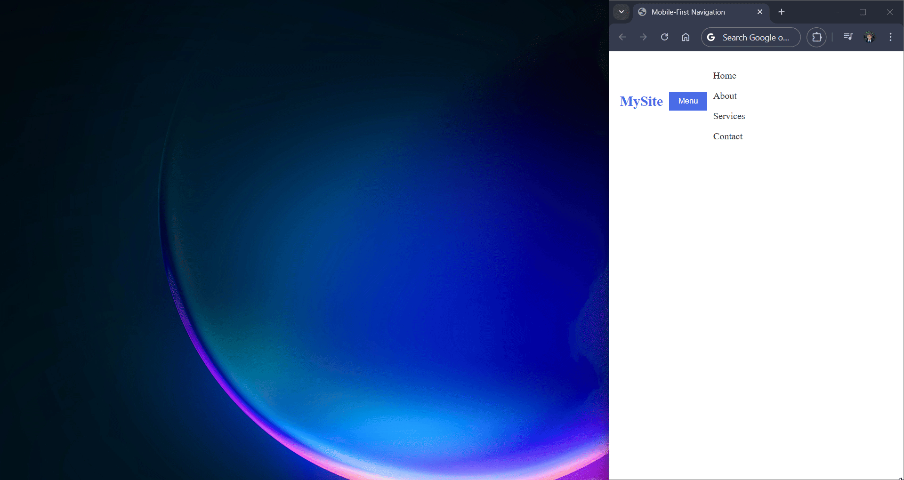
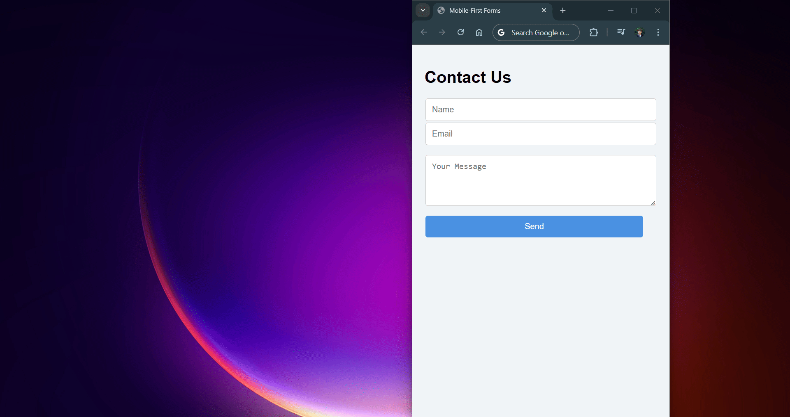

# Practical Frontend

## Variables:

### Introduction to Variables in CSS:

As you create bigger and more complex websites, managing repeated colors, sizes, or fonts gets harder. Changing one value means updating many places.

**CSS variables** let you save these values as names (like `--main-color`) and reuse them throughout your CSS. Change the variable once, and it updates everywhere automatically!

They are very helpful for keeping code clean and consistent, and many developers use them to build modern websites.

### Using CSS Variables:

CSS variables, also called **custom properties**, let you save values under a name and reuse them throughout your CSS.

Variables are declared inside a selector (commonly `:root` so the variable works everywhere on the page, it is called global) using the syntax:

#### Basic Syntax:

```css
:root {
 --main-color: midnightblue;
 --padding: 16px;
}
```

#### Breakdown:

* `:root`: Declares a global root selector so that it can be accessed anywhere on the website, since it is defined as a global-scope selector.
* `--main-color`: CSS variable which stores a value of a particular color.
* `--padding`: CSS variable which stores a padding value in pixels.

#### Utilizing Variables:

To use the value stored in a variable, you must use the `var()` function:

```css
.button {
  background-color: var(--main-color);
  padding: var(--padding);
}
```

#### Example of Usage:

```html
<!DOCTYPE html>
<html lang="en">
<head>
    <meta charset="UTF-8">
    <meta name="viewport" content="width=device-width, initial-scale=1">
    <title>How to declare a variable</title>
    <style>
        :root { /* Root selector with global scope variables */
            --bg-color: #4c87f5;
            --main-color: seagreen;
        }
        body {
            font-family: Arial, sans-serif;
            background: var(--bg-color);
            padding: 20px;
        }
        .movie {
            background: white;
            padding: 15px;
            margin-bottom: 15px;
            border-radius: 8px;
        }
        .movie h2 {
            margin: 0 0 10px;
        }
        .movie p {
            margin: 0 0 10px;
        }
        button {
            color: black;
            border: none;
            padding: 8px 12px;
            border-radius: 4px;
            cursor: pointer;
            /* Sets the background color to all buttons to seagreen */
            background-color: var(--main-color);
        }
    </style>
</head>
<body>
    <h1>Today's Movies</h1>
    <div class="movie">
        <h2>Ocean Whispers</h2>
        <p>A sailor discovers a hidden island and the secrets of the sea.</p>
        <button>Buy Ticket</button>
    </div>
    
    <div class="movie">
        <h2>Midnight Chase</h2>
        <p>A detective races against the clock to stop a mysterious heist.</p>
        <button>Buy Ticket</button>
    </div>
    
    <div class="movie">
        <h2>Starlight Bakery</h2>
        <p>A warm comedy about friendship and following your dreams.</p>
        <button>Buy Ticket</button>
</div>
</body>
</html>
```

##### Result:


### Variables for Design Tokens:

Now that we know how to declare and use CSS variables, let's see how they help organize your design.

**Design tokens** are special CSS variables that store your site's main colors, fonts, and other style values.

B using design tokens, you keep your styles consistent and easy to update - just change the token once, and the whole site reflects the change!

#### Basic Syntax:

Her is how to create CSS variables for you design tokens:

```css
:root {
  /* Colors */
  --primary-color: #3498db;
  --secondary-color: #2ecc71;
  
  /* Spacing */
  --spacing-small: 8px;
  --spacing-medium: 16px;
  --spacing-large: 24px;
  
  /* Typography */
  --font-size-small: 12px;
  --font-size-medium: 16px;
  --font-size-large: 24px;
}
```

And right here, we apply these design tokens to your elements:

```css
.button {
  background-color: var(--primary-color);
  padding: var(--spacing-small) var(--spacing-medium);
  font-size: var(--font-size-medium);
}

.card {
  border: 1px solid var(--secondary-color);
  margin: var(--spacing-medium);
  padding: var(--spacing-large);
}
```

#### Why use Design Tokens?

Using design tokens ensures consistency acros your website and makes updates easier, making the addition of new features and other variables simplified. But as the design token becomes robust, always keep variables organized based on specific sections, global/main styles, content spacing and so on.

#### Example of Usage:

```html
<!DOCTYPE html>
<html lang="en">
<head>
    <meta charset="UTF-8">
    <meta name="viewport" content="width=device-width, initial-scale=1">
    <title>Design Tokens</title>
    <style>
      /* Design tokens: colors, fonts, spacing */
      :root {
        --color-primary: #27ae60;
        --secondary-color: #f39c12;
        --color-text: #2c3e50;      
        --font-base: 'Segoe UI', Tahoma, Geneva, Verdana, sans-serif;
        --spacing-small: 8px;
        --spacing-medium: 16px;
        --spacing-large: 24px;
        --border-radius: 8px;
        --bg-light: #e8f5e9;
      }
    
      body {
        font-family: var(--font-base);
        color: var(--color-text);
        background: var(--bg-light);
        margin: 0;
        padding: var(--spacing-large);
        line-height: 1.5;
      }
    
      header {
        text-align: center;
        margin-bottom: var(--spacing-large);
      }
    
      header h1 {
        color: var(--color-primary);
        margin-bottom: 0.2em;
      }
    
      header p {
        font-size: 1.1rem;
        color: #4a6a4a;
      }
    
      section {
        max-width: 700px;
        margin: 0 auto;
        padding: var(--spacing-medium);
        background: white;
        border-radius: var(--border-radius);
        box-shadow: 0 4px 10px rgba(0,0,0,0.1);
      }
    
      h2 {
        margin-top: 0;
        color: var(--secondary-color);
      }
    
      article {
        margin-bottom: var(--spacing-large);
      }
    
      article:last-child {
        margin-bottom: 0;
      }
    
      .btn {
        display: inline-block;
        background-color: var(--color-primary);
        color: white;
        border: none;
        padding: var(--spacing-small) var(--spacing-small);
        border-radius: var(--border-radius);
        font-weight: 600;
        cursor: pointer;
        transition: background-color 0.3s ease;
        text-decoration: none;
      }
    
      .btn:hover {
        background-color: #1e8449;
      }
    </style>
    </head>
    <body>
    
    <header>
      <h1>Eat Healthy, Feel Great!</h1>
      <p>Your guide to nutritious and delicious foods.</p>
    </header>
    
    <section>
      <article>
        <h2>Avocados</h2>
        <p>Rich in healthy fats and fiber, avocados support heart health and keep you full longer.</p>
        <button class="btn">Learn More</button>
      </article>

      <article>
        <h2>Quinoa</h2>
        <p>A complete protein source, quinoa is great for vegetarians and provides essential amino acids.</p>
        <button class="btn">Learn More</button>
      </article>

      <article>
        <h2>Blueberries</h2>
        <p>Packed with antioxidants and vitamins, blueberries promote brain health and fight inflammation.</p>
        <button class="btn">Learn More</button>
      </article>
    </section>
</body>
</html>
```

##### Result:


### Local Variables:

You may have noticed we often use `:root` to declare variables, this is because `:root` is **global**. Variables defined here apply to the whole HTML page (as we mentioned before).

But sometimes you want variables that only affect certain parts of the page. For example, imagine building an online shop with many product cards, you can create variables inside a `.card` class to style just those cards without affecting other elements.

#### Basic Syntax:

```css
.card {
  --card-color: orchid;
  background-color: var(--card-color);
}
```

This way, the variable only works inside `.card` elements (class), giving you more control over specific areas.

#### Example of Usage:

```html
<html>
<head>
    <title>Local Variables</title>
    <link rel="preconnect" href="https://fonts.googleapis.com">
    <link rel="preconnect" href="https://fonts.gstatic.com" crossorigin>
    <link href="https://fonts.googleapis.com/css2?family=Playfair+Display:ital,wght@0,400..900;1,400..900&display=swap" rel="stylesheet">    <style>
      /* Global variable for body background */
      :root {
        --body-bg: #000f26;
        --font-family: "Playfair Display", serif;
      }
    
      body {
        background-color: var(--body-bg);
        font-family: var(--font-family);
        padding: 20px;
        display: flex;
        gap: 20px;
        justify-content: center;
      }
    
      /* Card styles */
      .card {
        --card-bg: white;
        --card-accent: coral;
        background-color: var(--card-bg);
        border-radius: 10px;
        padding: 15px;
        width: 250px;
        text-align: center;
        box-shadow: 0 4px 8px rgba(0,0,0,0.1);
      }
    
      .card h3 {
        color: var(--card-accent);
        margin-top: 0;
      }
    
      .card p {
        font-size: 0.9rem;
        color: #333;
      }
    
      .card button {
        border: none;
        background-color: var(--card-accent);
        color: #000f26;
        padding: 8px 12px;
        border-radius: 5px;
        cursor: pointer;
        font-weight: bold;
        margin-top: 10px;
        width: 100%;
      }
    
    </style>
    </head>
    <body>
    
    <div class="card">
      <h3>Classic Sneakers</h3>
      <p>Comfortable and stylish sneakers for everyday wear.</p>
      <button>Buy Now</button>
    </div>
    
    <div class="card special">
      <h3>Luxury Watch</h3>
      <p>Elegant watch with a unique design for special occasions.</p>
      <button>Buy Now</button>
    </div>
    
    <div class="card">
      <h3>Leather Backpack</h3>
      <p>Durable, spacious backpack made from premium leather.</p>
      <button>Buy Now</button>
    </div>
    
    </body>
</html>
```

##### Result:


### Recap - Variables:

Here is the recap on **variables**:

* **Declaring Variables**: Variables must be declared inside a selector (either inside a `:root` or a specific element/class/id `.nameOfClass`), with the syntax `--var-name: value;`:
    - `--var-name`: The variable name, that should always start with two dashes/hyphens.
    - `value`: The desired value that the variable will hold, this can represent any possible value in the CSS context.
* **Using Variables**: Manipulate with the `var()` function to effectively mention global or local-scope variables following the syntax `color: var(--color-var);`:
    - `color`: The `color` property used to add coloring to text.
    - `var(--color-var)`: The section which mentions the variable inside the `var()` function, this variable stores the desired value like `blue` or `pink`...

#### Example of a Webpage:

```html
<html>
<head>
  <title>CSS Variables Recap Challenge</title>
  <style>
    /* Global Variables */
    :root {
      --main-bg: #fdf00f;
      --main-font: 'Segoe UI', serif;
    }

    body {
      margin: 0;
      padding: 0;
      background-color: var(--main-bg);
      font-family: var(--main-font);
    }

    header {
      background-color: var(--primary-color);
      color: white;
      padding: 20px;
      text-align: center;
    }

    header h1 {
      margin: 0;
      font-size: 2rem;
    }

    header p {
      margin: 5px 0 0;
      font-size: 1rem;
      opacity: 0.9;
    }

    main {
      padding: 20px;
      display: grid;
      gap: 20px;
      grid-template-columns: repeat(auto-fit, minmax(250px, 1fr));
    }
    .hero {
        background: url('https://upload.wikimedia.org/wikipedia/commons/c/c0/Healthy_Food_-_Colourful_Fruit_and_Veg_-_50191699151.jpg') center/cover no-repeat;
        color: white;
        text-align: center;
        padding: 30px 20px 50px 20px;
        border-radius: 10px;
        margin: 10px;
        }

    .hero button {
        background-color: var(--primary-color);
        padding: 10px 20px;
        border: none;
        border-radius: 5px;
        font-weight: bold;
        cursor: pointer;
        color: white;
    }

    .card {
      /* Local Variable for Card */
      --card-accent: tomato;

      background: white;
      border-radius: 10px;
      padding: 15px;
      box-shadow: 0 4px 8px rgba(0, 0, 0, 0.1);
      display: flex;
      flex-direction: column;
      justify-content: space-between;
    }

    .card h2 {
      margin: 0 0 10px;
      color: var(--card-accent);
    }

    .card p {
      font-size: 0.9rem;
      color: #333;
    }

    .card button {
      background-color: var(--card-accent);
      margin-top: 10px;
      border: none;
      padding: 8px 12px;
      color: black;
      border-radius: 5px;
      font-weight: bold;
      cursor: pointer;
    }

    footer {
      background-color: #eee;
      text-align: center;
      padding: 15px;
      font-size: 0.85rem;
      margin-top: 20px;
    }
  </style>
</head>
<body>

  <header>
    <h1>Healthy Recipes</h1>
    <p>Fresh, tasty, and colorful meals you can make at home</p>
  </header>
<section class="hero">
  <div class="hero-content">
    <h2>Eat Healthy, Live Happy</h2>
    <button>Explore Recipes</button>
  </div>
</section>
  <main>
    <div class="card">
      <h2>Avocado Salad</h2>
      <p>A healthy salad with fresh avocado, tomatoes, and herbs.</p>
      <button>Read Recipe</button>
    </div>

    <div class="card special">
      <h2>Berry Smoothie</h2>
      <p>Refreshing smoothie with blueberries, strawberries, and yogurt.</p>
      <button>Read Recipe</button>
    </div>

    <div class="card">
      <h2>Quinoa Bowl</h2>
      <p>Nutritious quinoa with roasted vegetables and chickpeas.</p>
      <button>Read Recipe</button>
    </div>
  </main>

  <footer>
    &copy; 2025 Healthy Recipes. All rights reserved.
  </footer>

</body>
</html>
```

##### Result:


## Mobile-First Strategy:

### What "mobile-first" means:

**Mobile-first** is a design strategy where you build your website for mobile devices first, then progressively enhance it for larger screens.

The main idea is that most users now brows th wb on their phons, so starting small ensures your site works wll for the majority of visitors.

#### Starting Point for Writing Mobile Styles:

The first step is to start writing mobile styles:

```css
body {
  font-size: 16px;
  padding: 10px;
}
```

Then you would use **media queries** to adapt your design for larger screens:

```css
/* Styles for devices wider than 768px */
@media (min-width: 768px) {
  body {
    font-size: 18px;
    padding: 20px;
  }
}
```

This approach ensures your site works well on small screens first, then enhances the experience for users on larger devices.

#### Example of Usage:

```html
<!DOCTYPE html>
<html>
<head>
  <title>What “mobile-first” means</title>
  <style>
    /* Mobile-first Approach */
    .menu {
      display: flex;
      flex-direction: column;
      width: auto;
      max-height: 250px;
      list-style: none;
      padding: 0;
      margin: 0;
    }
    
    .menu li {
      margin-bottom: 10px;
      background-color: rgb(25, 220, 10);
      margin-right: 10px;
      padding: 10px;
    }
    
    .menu a {
      display: block;
      text-align: center;
      text-decoration: none;
      color: black;
    }
    
    /* Bigger screen styles */
    @media (min-width: 768px) {
      .menu {
        display: flex;
        flex-direction: row;
        padding: 3px;
      }
      
      .menu li {
      
      }
    }
  </style>
</head>
<body>
  <nav>
    <ul class="menu">
      <li><a href="#">Home</a></li>
      <li><a href="#">About</a></li>
      <li><a href="#">Services</a></li>
      <li><a href="#">Contact</a></li>
    </ul>
  </nav>
</body>
</html>
```

##### Result:


### Mobile-First Typography:

**Mobile-first typography** means starting with text styles that are easy to read on small screens, then adjusting them for larger screens with media queries.

We use it because mobile users need **clear, legible fonts** that work well on small displays. If text is too small, et becomes hard to read, and if it's too large on desktop, it can look awkward.

#### Setting up the Mobile-First Typography:

Set up your base font-size for mobile:

```css
/* Mobile-first styles */
body {
  font-size: 16px; /* base size for mobile */
}

h1 {
  font-size: 1.5rem;
}
```

Then, utilize media queries to adjust for larger screens:

```css
/* Larger screens */
@media (min-width: 768px) {
  body {
    font-size: 18px;
  }
  
  h1 {
    font-size: 2rem;
  }
}
```

#### Example of Usage:

```html
<!DOCTYPE html>
<html>
<head>
  <title>Mobile-First Typography</title>
  <style>
    /* ===== Mobile-First Styles ===== */
    :root {
      --base-font-size: 16px;
      --base-heading-font-size: 24px;
    }

    body {
      font-size: var(--base-font-size);
      font-family: Arial, sans-serif;
      margin: 0;
      padding: 0;
      line-height: 1.5;
      background-color: #f0f8ff;
      color: #333;
    }

    header {
      background: url('https://upload.wikimedia.org/wikipedia/commons/a/af/Female_polar_bear_%28Ursus_maritimus%29_with_cub%2C_Svalbard.jpg')
                  center/cover no-repeat;
      color: white;
      text-align: center;
      padding: 50px 20px;
    }

    header h1 {
      font-size: var(--base-heading-font-size);
      margin: 0;
    }

    .subtitle {
      margin-top: 10px;
      font-size: 1rem;
      opacity: 0.9;
    }

    main {
      padding: 20px;
    }

    h2 {
      color: #2c6e91;
      font-size: 1.25rem;
    }

    p { font-size: var(--base-font-size); }

    ul {
      padding-left: 20px;
    }

    li {
      margin-bottom: 10px;
    }

    footer {
      background-color: #2c6e91;
      color: white;
      text-align: center;
      padding: 15px;
      font-size: 0.9rem;
    }

    /* ===== Larger Screens ===== */
    @media (min-width: 768px) {
      header h1 { font-size: 36px; }
      p { font-size: 20px; }
    }

  </style>
</head>
<body>
  <header>
    <h1>Polar Bears – Kings of the Arctic</h1>
    <p class="subtitle">Discover the life of the world's largest land carnivore</p>
  </header>

  <main>
    <section>
      <h2>About Polar Bears</h2>
      <p>
        Polar bears are magnificent animals that live in the Arctic region. 
        They are excellent swimmers, using their large paws to paddle through icy waters 
        in search of seals, their main source of food. These bears have thick layers of 
        fat and dense fur to keep them warm in extreme cold.
      </p>
    </section>

    <section>
      <h2>Interesting Facts</h2>
      <ul>
        <li>Polar bears can weigh up to 700 kg (1,500 lbs).</li>
        <li>They have black skin under their white fur to absorb heat.</li>
        <li>Polar bears can swim for days without resting.</li>
        <li>They are listed as vulnerable due to climate change.</li>
      </ul>
    </section>

    <section>
      <h2>Protecting Polar Bears</h2>
      <p>
        Climate change and melting sea ice threaten polar bear habitats. 
        Protecting these amazing creatures requires global efforts to 
        reduce greenhouse gas emissions and preserve their Arctic environment.
      </p>
    </section>
  </main>

  <footer>
    <p>&copy; 2025 Arctic Wildlife. All rights reserved.</p>
  </footer>
</body>
</html>
```

##### Result:


### Mobile-First Navigation:

**Mobile-first navigation** means starting with a simple, touch-friendly menu for small screens, then enhancing it for larger screens.

Start with a basic mobile navigation structure: inside the `<nav>` element, include a button and a list.

#### Basic Syntax:

```html
<nav class="main-nav">
  <button class="menu-toggle">Menu</button>
  <ul class="nav-list">
    <li><a href="#">Home</a></li>
    <li><a href="#">About</a></li>
    <li><a href="#">Services</a></li>
    <li><a href="#">Contact</a></li>
  </ul>
</nav>
```

After, we apply mobile styling on small screens, where it shows a "menu" button and hide the list.

```css
.menu-toggle {
  display: block;
  /* some more styles... */
}

.nav-list {
  display: none;
  /* some more styles... */
}
```

Next, we use media queries for larger screens. On larger screens, we will show the menu as a horizontal list at the top and hide a "menu" button.

```css
@media (min-width: 768px) {
  .menu-toggle {
    display: none;
  }
  
  .nav-list {
    display: flex;
  }
}
```

This approach ensures the navigation is optimized for mobile devices first, then enhanced for larger screens.

#### Example of Usage:

```html
<!DOCTYPE html>
<html lang="en">
<head>
  <meta charset="UTF-8">
  <meta name="viewport" content="width=device-width, initial-scale=1">
  <title>Mobile-First Navigation</title>
  <style>
    :root {
      --primary-color: #4a6de5;
      --text-color: #333333;
    }
    
    .nav-container {
      display: flex;
      justify-content: space-between;
      align-items: center;
    }
    
    .logo {
      font-weight: bold;
      color: var(--primary-color);
      text-decoration: none;
      font-size: 1.5rem;
      margin: 10px;
    }
    
    .menu-toggle {
      display: block;
      background-color: var(--primary-color);
      color: white;
      border: none;
      padding: 0.5rem 1rem;
      cursor: pointer;
      margin-right: 10px;
    }
    
    .nav-list {
      /* display: none; */
      list-style: none;
      padding: 0;
      margin: 1rem 0 0 0;
      width: 100%;
      gap: 1px;
    }
  
    .nav-list li a {
      color: var(--text-color);
      text-decoration: none;
      display: block;
      padding: 0.5rem 0;
    }
    
    @media (min-width: 768px) {
      .menu-toggle {
        display: none;
      }
      
      .nav-list {
        display: flex;
        margin: 0;
        width: auto;
      }
      
      .nav-list li {
        margin: 0 0 0 1.5rem;
      }
    }
  </style>
</head>
<body>
  <header class="site-header">
    <nav class="nav-container">
      <a href="#" class="logo">MySite</a>
      <button class="menu-toggle">Menu</button>
      <ul class="nav-list">
        <li><a href="#">Home</a></li>
        <li><a href="#">About</a></li>
        <li><a href="#">Services</a></li>
        <li><a href="#">Contact</a></li>
      </ul>
    </nav>
  </header>
</body>
</html>
```

##### Result:



### Mobile-First Images:

**Mobile-first images** means making sure pictures work well on small screens first, then enhancing them for larger displays. On mobile, big heavy images can slow down loading, so e start with **smaller, optimized versions**. As screens get bigger, we can swap in higher-quality images.

#### How to Apply the Principles:

For this operation, we will use the HTML `<picture>` element to serve different image sizes based on screen width.

* `<picture>`: The wrapper that holds multiple image options for different screens.
* `<source>`: Defines which image to load (`srcset`) and under what condition (`media`). Here is an example: A phone with less or equal to 600px (≤600px), would generate a small image. But for a tablet with a screen size at the range of (≤1024px), would generate a medium image.
* ``: This represents the fallback if no `<source>` matches, ususally the large desktop image. Also contains the `alt` text.

#### Basic Syntax:

```html
<picture>
  <source srcset="small-image.jpg" media="(max-width: 600px)">
  <source srcset="medium-image.jpg" media="(max-width: 1024px)">
  
</picture>
```

#### Example of Usage:

```html
<!DOCTYPE html>
<html>
<head>
  <title>Mobile-First Images</title>
  <style>
        body {
      font-family: Arial, sans-serif;
      margin: 0;
      padding: 1rem;
      line-height: 1.6;
      background: #0a0a23;
      color: #f5f5f5;
    }

    header {
      text-align: center;
      margin-bottom: 1.5rem;
    }

    h1 {
      font-size: 1.5rem;
      color: #ffd369;
    }

    .content {
      max-width: 800px;
      margin: 0 auto;
    }

    img {
      max-width: 100%;
      height: auto;
      border-radius: 8px;
      margin: 1rem 0;
    }

    p {
      font-size: 1rem;
    }

    @media (min-width: 768px) {
      h1 {
        font-size: 2.25rem;
      }

      p {
        font-size: 1.125rem;
      }
    }
  </style>
</head>
<body>
    <header>
    <h1>The Moon</h1>
  </header>

  <main class="content">
    <p>
      The Moon is Earth's only natural satellite and has fascinated humans for thousands of years. 
      It influences tides, inspires myths, and continues to be a target for exploration.
    </p>

    <picture>
      <source srcset="https://upload.wikimedia.org/wikipedia/commons/e/e1/FullMoon2010.jpg" media="(min-width: 768px)">
      
    </picture>

    <p>
      Mobile-first images ensure the page loads fast on smaller devices while still looking 
      beautiful on bigger screens.
    </p>
  </main>
</body>
</html>
```

##### Result:


### Mobile-First Forms:

Forms are one of the most important parts of the web - users type, tap and interact with them constantly. When designing forms for mobile first, we focus on **usability** on **small screens**.

#### Key Importances:

* Make inputs and buttons bigger so users can easily type and tap.
* Stack fields vertically and use full-width inputs.
* Add padding and spacing for fingers.

#### Example of Smaller Screens:

Here is an example for mobile:

```css
input, button {
  width: 100%;       /* full width for small screens */
  padding: 0.75rem;  /* easier to tap */
  font-size: 1rem;   /* readable text */
}
```

##### What is the REM Unit?

The `rem` unit stands for "root em", which is a **relative unit of measurement** that is always based on the `font-size` of the root element of the document (the `<html>` element).

This means that no matter how deeply nested an element is in the HTML structure, a `rem` value used for any of its properties (like `font-size`, `margin`, `padding`, `width`) will consistently refer back to the single, global font size defined on the `<html>` tag.

#### Transferring to Larger Screens:

The, for **larger screens (tablets or desktops), we enhance the layout:

* Center the form on the page.
* Place some fields side by side instead of stacking.
* Adjust widths and spacing for better appearance.

#### Example of Larger Screens:

```css
@media (min-width: 768px) {
  form {
    max-width: 500px;  /* center and limit width */
    margin: 0 auto;
  }

  .row {
    display: flex;
    gap: 1rem;         /* side-by-side inputs */
  }
}
```

#### Example of Usage:

```html
<!DOCTYPE html>
<html>
<head>
  <title>Mobile-First Forms</title>
  <style>
    body {
      font-family: Arial, sans-serif;
      padding: 1rem;
      background-color: #f0f4f8;
    }

    form {
      display: flex;
      flex-direction: column;
      margin-right: 1.8rem;
      gap: 1rem;
    }

    input, textarea, button {
      width: 100%;
      padding: 0.75rem;
      font-size: 1rem;
      border: 1px solid #ccc;
      border-radius: 5px;
      margin: 0.1rem;
    }

    button {
      background-color: #4a90e2;
      color: white;
      border: none;
      cursor: pointer;
    }

    /* Larger screens */
    @media (min-width: 768px) {
      form {
        max-width: 600px;
        margin: 0 auto; /* center form */
      }

      .row {
        display: flex;
        gap: 1rem; /* side-by-side fields */
      }

      .row input {
        width: 100%; /* split space equally */
      }

      textarea { width: 573px; }
    }
  </style>
</head>
<body>
  <h1>Contact Us</h1>
  <form>
    <div class="row">
      <input type="text" placeholder="Name" required>
      <input type="email" placeholder="Email" required>
    </div>
    <textarea placeholder="Your Message" rows="4" required></textarea>
    <button type="submit">Send</button>
  </form>
</body>
</html>
```

##### Result:



### Recap - Mobile-First Strategy:

* **Mobile-First Meaning**: The mobile-first strategy consists of the development of an UI that is primarily targeting mobile users (where the styles are tweaked for smaller screens by default), but also progressively implementing styles for larger screens later on.
The developer would first initiate styles for mobile users:

```css
body {
  font-size: 15px;
  padding: 10px;
}
```

Then they would manipulate with **media queries** to verify if the size of the user's screen is **greater or equal to 768px**, then to override the mobile styles and replace them with styles that would be suitable for larger screens:

```css
@media (min-width: 768px) {
  body {
    font-size: 18px;
    padding: 20px;
  }
}
```

* **Mobile-First Typography**: Starts with text styling and modifications for mobile screen sizes, before moving on to larger screens.

Set up your base font-size for mobile:

```css
/* Mobile-first styles */
body {
  font-size: 16px; /* base size for mobile */
}

h1 {
  font-size: 1.5rem;
}
```

Then, utilize media queries to adjust for larger screens:

```css
/* Larger screens */
@media (min-width: 768px) {
  body {
    font-size: 18px;
  }
  
  h1 {
    font-size: 2rem;
  }
}
```

* **Mobile-first navigation**: Starting with a simple, touch-friendly menu for small screens, then enhancing it for larger screens.

```html
<nav class="main-nav">
  <button class="menu-toggle">Menu</button>
  <ul class="nav-list">
    <li><a href="#">Home</a></li>
    <li><a href="#">About</a></li>
    <li><a href="#">Services</a></li>
    <li><a href="#">Contact</a></li>
  </ul>
</nav>
```

After, we apply mobile styling on small screens, where it shows a "menu" button and hide the list.

```css
.menu-toggle {
  display: block;
  /* some more styles... */
}

.nav-list {
  display: none;
  /* some more styles... */
}
```

Next, we use media queries for larger screens. On larger screens, we will show the menu as a horizontal list at the top and hide a "menu" button.

```css
@media (min-width: 768px) {
  .menu-toggle {
    display: none;
  }
  
  .nav-list {
    display: flex;
  }
}
```

* **Mobile-first images**: Make sure pictures work well on small screens first, then enhancing them for larger displays. Take a look at the HTML structure:

```html
<picture>
  <source srcset="small-image.jpg" media="(max-width: 600px)">
  <source srcset="medium-image.jpg" media="(max-width: 1024px)">
  
</picture>
```

  -  `<picture>`: The wrapper that holds multiple image options for different screens.
  - `<source>`: Defines which image to load (`srcset`) and under what condition (`media`). Here is an example: A phone with less or equal to 600px (≤600px), would generate a small image. But for a tablet with a screen size at the range of (≤1024px), would generate a medium image.
  -  ``: This represents the fallback if no `<source>` matches, usually the large desktop image. Also contains the `alt` text.

* **Mobile-First Forms**: Same concept applies, but focussing primarily on legibility and interactivity for an user-friendly UI.

Here, we define your styles for mobile:

```css
input, button {
  width: 100%;       /* full width for small screens */
  padding: 0.75rem;  /* easier to tap */
  font-size: 1rem;   /* readable text */
}
```

Then move to larger screen styles:

```css
@media (min-width: 768px) {
  form {
    max-width: 500px;  /* center and limit width */
    margin: 0 auto;
  }

  .row {
    display: flex;
    gap: 1rem;         /* side-by-side inputs */
  }
}
```

* **`rem` Unit**: The `rem` unit stands for "root em", which is a **relative unit of measurement** that is always based on the `font-size` of the root element of the document (the `<html>` element).
Using the `rem` unit in CSS for mobile styling is highly recommended primarily for **enhanced accessibility and simplified responsive design and maintenance**. Because `rem` units are relative to the root (`<html>`) element's font size, they ensure <i>consistent and proportional scaling across various devices and user preferences</i>.

#### Example of a Website:

```html
<!DOCTYPE html>
<html lang="en">
<head>
  <meta charset="UTF-8">
  <meta name="viewport" content="width=device-width, initial-scale=1">
  <title>Mobile-First Profile</title>
  <style>
    :root {
      --text-align: center;
      --image-align: center;
      --primary-font: Arial, sans-serif;
      --heading-font: 'Helvetica', sans-serif;
      --h1-size: 2rem;
      --h2-size: 1.5rem;
      --body-font-size: 16px;
      --primary-color: #4a90e2;
      --secondary-color: #f0f4f8;
      --image-align: center;
      --form-align: center;
      --nav-align: center;
    }

    body {
      text-align: var(--text-align);
      font-family: var(--primary-font);
      font-size: var(--body-font-size);
      margin: 0;
      padding: 20px;
      background-color: var(--secondary-color);
    }

    h1 {
      font-family: var(--heading-font);
      font-size: var(--h1-size);
      color: var(--primary-color);
      margin-bottom: 5px;
    }

    h2 {
      font-family: var(--heading-font);
      font-size: var(--h2-size);
      color: #333;
      margin-top: 0;
    }

    nav {
      margin-bottom: 20px;
    }

    .menu-button {
      display: block;
      padding: 10px 15px;
      background-color: var(--primary-color);
      color: white;
      border: none;
      border-radius: 5px;
      cursor: pointer;
      margin-bottom: 10px;
    }

    .nav-list {
      display: none;
      list-style: none;
      padding: 0;
      margin: 0;
    }

    .nav-list li {
      margin-bottom: 10px;
    }

    .nav-list li a {
      text-decoration: none;
      color: var(--primary-color);
    }

    .image-container {
      display: flex;
      justify-content: center;
    }

    .profile-img {
      width: 100%;
      max-width: 250px;
      border-radius: 50%;
      margin-bottom: 20px;
      display: block;
    }

    section p {
      line-height: 1.6;
      margin-bottom: 20px;
    }
    
    form {
      display: flex;
      flex-direction: column;
      max-width: 100%;
      gap: 10px;
    }

    input, textarea, button {
      padding: 10px;
      border: 1px solid #ccc;
      border-radius: 5px;
      font-size: 1rem;
    }

    button {
      background-color: var(--primary-color);
      color: white;
      cursor: pointer;
    }

    /* Media queries for larger screens */
    @media (min-width: 768px) {
      .menu-button { display: none; }
      .nav-list {
        display: flex;
        justify-content: center;
        gap: 20px;
      }

      .nav-list li {
        margin-bottom: 0;
      }

      .form-section {
        display: grid;
        grid-template-columns: 1fr minmax(300px, 700px) 1fr; /* Adjust min/max as needed */
        align-items: center;
        width: 100%;
      }

      .form-container {
        grid-column: 2; /* Center column */
      }

      input[name="name-input"] { grid-area: name; }
      input[name="email-input"] { grid-area: email; }
      input[name="text-input"] { grid-area: text; }
      input[name="submit-button"] { grid-area: submit; }
    }
  </style>
</head>
<body>
  <nav>
    <button class="menu-button">Menu</button>
    <ul class="nav-list">
      <li><a href="#">Home</a></li>
      <li><a href="#">About</a></li>
      <li><a href="#">Contact</a></li>
    </ul>
  </nav>

  <header>
    <h1>Jane Doe</h1>
    <h2>Web Developer & Designer</h2>
  </header>

  <section>
    <picture class="image-container">
      <source srcset="https://upload.wikimedia.org/wikipedia/commons/1/1f/Woman_1.jpg" media="(min-width: 768px)">
      
    </picture>
  </section>

  <section>
    <p>Welcome to my profile! I specialize in creating mobile-first, responsive websites that look great on any device. My focus is on performance, accessibility, and clean design.</p>
  </section>

  <section class="form-section">
    <div></div>
    <form class="form-container">
      <input type="text" name="name-input" placeholder="Your Name">
      <input type="email" name="email-input" placeholder="Your Email">
      <textarea placeholder="Your Message" name="text-input"></textarea>
      <button type="submit" name="submit-button">Send Message</button>
    </form>
    <div></div>
  </section>
</body>
</html>
```

##### Result:


## Theming & Visual Styles:

### Theming in CSS:

**Theming in CSS** means creating a consistent look for  website by using reusable colors, fonts, and styles. Instead of repeating the same code everywhere, you define your theme once (for example, setting a main color and accent color) and apply it across the whole website. This makes the design feel professional and unified.

#### Basic Syntax:

The most common approach is using **CSS variables** to define them values:

```css
:root {
  --primary-color: #4a90e2;
  --secondary-color: #f5a623;
  --font-family: 'Arial, sans-serif';
}

body {
  font-family: var(--font-family);
  color: var(--primary-color);
}

button {
  background-color: var(--secondary-color);
  color: white;
}
```

#### Example of Usage:

```html
<!DOCTYPE html>
<html>
<head>
  <title>Theming in CSS</title>
  <style>
    /* Theming with CSS Variables */
    :root {
      --primary-color: purple;
      --secondary-color: violet;
      --bg-color: #f0c4f8;
      --text-color: #333333;
      --font-family: 'Arial, sans-serif';
      --margin: 1rem;
    }

    body {
      margin: 0;
      font-family: var(--font-family);
      background-color: var(--bg-color);
      color: var(--text-color);
    }

    header {
      background-color: var(--primary-color);
      color: white;
      padding: 1.5rem;
      text-align: center;
    }

    header h1 {
      margin: 0;
      font-size: 2rem;
    }

    nav a {
      color: white;
      text-decoration: none;
      margin: 0 1rem;
      font-weight: bold;
    }

    main {
      padding: 2rem;
    }

    section {
      margin-bottom: var(--margin);
    }

    h2 {
      color: var(--primary-color);
    }

    p {
      line-height: 1.6;
    }

    .highlight {
      color: var(--secondary-color);
      font-weight: bold;
    }

    .button {
      display: inline-block;
      padding: 0.75rem 1.5rem;
      background-color: var(--secondary-color);
      color: white;
      text-decoration: none;
      border-radius: 5px;
      margin-top: 1rem;
    }

    footer {
      background-color: var(--primary-color);
      color: white;
      text-align: center;
      padding: 1rem;
    }
  </style>
</head>
<body>

  <header>
    <h1>Mountain Hiking Adventures</h1>
    <nav>
      <a href="#">Home</a>
      <a href="#">Trails</a>
      <a href="#">Gear</a>
      <a href="#">Contact</a>
    </nav>
  </header>

  <main>
    <section>
      <h2>Explore the Mountains</h2>
      <p>Discover breathtaking trails, enjoy nature, and challenge yourself with our curated hiking routes. Whether you're a beginner or an expert, there is a path for everyone. <span class="highlight">Adventure awaits!</span></p>
      <a href="#" class="button">Learn More</a>
    </section>

    <section>
      <h2>Essential Gear</h2>
      <p>Prepare for your hikes with the right gear. From backpacks to boots, we provide tips on choosing items that will keep you safe and comfortable. <span class="highlight">Stay prepared!</span></p>
      <a href="#" class="button">Shop Gear</a>
    </section>

    <section>
      <h2>Join Our Community</h2>
      <p>Connect with fellow hikers, share your experiences, and participate in group hikes. Our community is welcoming and supportive for all skill levels. <span class="highlight">Join us today!</span></p>
      <a href="#" class="button">Sign Up</a>
    </section>
  </main>

  <footer>
    &copy; 2025 Mountain Hiking Adventures. All rights reserved.
  </footer>

</body>
</html>
```

##### Result:

